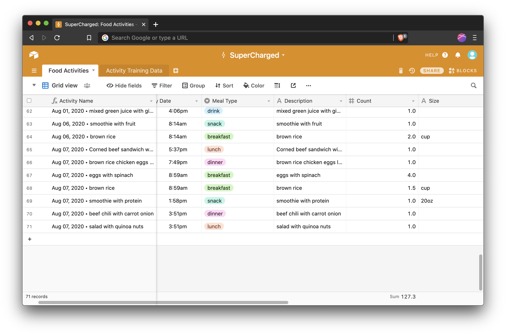

# *Supercharged!*



Natural language activity tracking with GPT-3

## Deployment

1. Copy `config.example.yaml` to `config.yaml` and update it accordingly with:
   - Your GPT3 API key (closed beta right now), 
   - Your Airtable base and table information

2. Deploy this repository as a Google Cloud function:

```shell
./scripts/deploy.sh YOUR_FUNCTION_NAME
```

3. Create a phone number in Twilio with SMS capabilities and configure its webhook URL to `POST` to the newly created Google Cloud function.

4. Text the new number with your activities in natural language and watch as your Airtable is updated automatically!

## Training

If the model makes a mistake, you can train it to learn what you mean. Update the training data in Airtable to reflect the correct labeling of each part-of-speech.

*More training resources coming soon...*

## Development

```shell
npm install
npm test
npm run build
npm run start
```

## License

BSD 3-Clause
